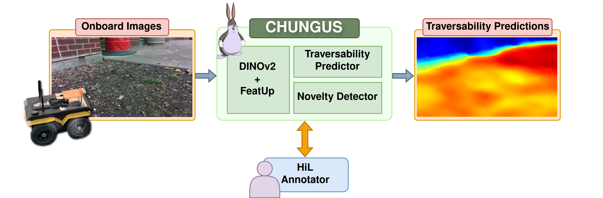

# CHUNGUS (RA-L 2025)

Fork of [elevation_mapping_cupy](https://github.com/andreschreiber/CHUNGUS). Created for research purposes.

Repository for the RA-L 2025 paper: "Do You Know the Way? Human-in-the-Loop Understanding for Fast Traversability Estimation in Mobile Robotics" (Andre Schreiber and Katherine Driggs-Campbell).

Website: https://andreschreiber.github.io/chungus.html

Paper: https://ieeexplore.ieee.org/abstract/document/10974681



## Abstract
The increasing use of robots in unstructured environments necessitates the development of effective perception and navigation strategies to enable field robots to successfully perform their tasks. In particular, it is key for such robots to understand where in their environment they can and cannot travel—a task known as traversability estimation. However, existing geometric approaches to traversability estimation may fail to capture nuanced representations of traversability, whereas vision-based approaches typically either involve manually annotating a large number of images or require robot experience. In addition, existing methods can struggle to address domain shifts as they typically do not learn during deployment. To this end, we propose a human-in-the-loop (HiL) method for traversability estimation that prompts a human for annotations as-needed. Our method uses a foundation model to enable rapid learning on new annotations and to provide accurate predictions even when trained on a small number of quickly-provided HiL annotations. We extensively validate our method in simulation and on real-world data, and demonstrate that it can provide state-of-the-art traversability prediction performance.

## Installation / Set up
The installation procedure uses Docker and has been tested for Ubuntu 22.04.

### Prerequisite Data
- Clone my FeatUp fork into the `docker/dependencies` folder. This can be done as follows (when run within the `docker` folder):
    ```
    git clone https://github.com/andreschreiber/FeatUp-ROS.git dependencies/featup/
    ```
- Copy the "torch_cache" folder from Box (https://uofi.box.com/s/qivs7e5d9fgm46nkdc7oc4z7nhhp5875) to the folder `docker/dependencies/` and unzip it in dependencies (i.e, there should then be a folder `docker/dependencies/torch_cache` that contains a folder `hub/` that in turn has a bunch of folders with checkpoints). This can be done with the following commands (when run within the `docker` folder):
    ```
    curl -L https://uofi.box.com/shared/static/1ca2s1wa16r6l43ncfl33e48ky4ijlr0 --output dependencies/torch_cache.zip
    unzip dependencies/torch_cache.zip -d ./dependencies/
    rm dependencies/torch_cache.zip
    ```
-  Copy the contents of the `embedding_init` and `images_init` folders from Box (https://uofi.box.com/s/rwo5rwycrovl8dtkmd1dbqcaa2mu0ep7) to the folder `ros/data/` (the zip files in `images_init` should be unzipped using `unzip sim.zip` and `unzip outdoor.zip` from within the `ros/data/images_init` folder once the two downloaded zip files are moved there). This can be done with the following commands (when run from within the `ros/data/` folder):
    ```
    # Get the embeddings
    curl -L https://uofi.box.com/shared/static/k28fmyn9qcnjspka0dzecw3px1ixmy99 --output embeddings_init/dinov2_224x224_sim_all.npy # Embeddings from our custom simulator
    curl -L https://uofi.box.com/shared/static/ymywqgyjpc1twwafghhbv3q5uhy22zbc --output embeddings_init/dinov2_224x224_outdoor_all.npy # Embeddings from our outdoor dataset
    curl -L https://uofi.box.com/shared/static/ma88hgy1wbql55f6mj82ms7pd15l7ua0 --output embeddings_init/blank_embeddings.npy # Blank embeddings
    
    # Get the images
    curl -L https://uofi.box.com/shared/static/uwotl26hus4gbjexuitvpl9qf1m1a2gl --output images_init/sim.zip # Images from our custom simulator
    unzip images_init/sim.zip -d images_init/
    rm images_init/sim.zip
    curl -L https://uofi.box.com/shared/static/ay74w0unxtq1f42qybdoktqxo97q5xw6 --output images_init/outdoor.zip # Images from our outdoor dataset
    unzip images_init/outdoor.zip -d images_init/
    rm images_init/outdoor.zip
    ```
- Copy the contents of the folders `sim` and `outdoor` from Box (https://uofi.box.com/s/m3m4c8zg4qjl74ijd2c8uhn974i963ux) to the folder `offline/data`. In addition, download the images from Box (https://uofi.box.com/s/71n2mkp5bufdm16d9fbypk3dfbkw9rel) to subfolders `images` of the folders `sim` and `outdoor` that were just created in `offline/data` (note: these images are the same as the ones downloaded in the prior step, so you could also not download these again and simply modify the paths in your command line arguments for the offline training/embedding generation code appropriately). To download the necessary offline files, go to the `offline/data` folder and execute:
    ```
    # For sim data
    mkdir sim
    curl -L https://uofi.box.com/shared/static/uwotl26hus4gbjexuitvpl9qf1m1a2gl --output sim/images.zip
    unzip sim/images.zip -d sim/extracted
    mv sim/extracted/sim sim/images
    rm -r sim/extracted
    rm sim/images.zip
    curl -L https://uofi.box.com/shared/static/drtl31skx8f93gxt6jcjkpsnhe7zkmrb --output sim/train_sim_combined.csv # Train labels
    curl -L https://uofi.box.com/shared/static/sylweik9w2516rq74xd031hrknh1en0h --output sim/val_sim_combined.csv # Val labels
    curl -L https://uofi.box.com/shared/static/8uowtfg1pierc0kaewq57o7eo8inpo4r --output sim/all_sim_combined.csv # All labels (train+val combined)

    # For outdoor data
    mkdir outdoor
    curl -L https://uofi.box.com/shared/static/ay74w0unxtq1f42qybdoktqxo97q5xw6 --output outdoor/images.zip
    unzip outdoor/images.zip -d outdoor/extracted
    mv outdoor/extracted/outdoor outdoor/images
    rm -r outdoor/extracted
    rm outdoor/images.zip
    curl -L https://uofi.box.com/shared/static/symebllmfne16cd66f0x3mqk2xg3jaqp --output outdoor/train_outdoor_combined.csv # Train labels
    curl -L https://uofi.box.com/shared/static/9uy1xlufq71w2hof2uikke2pcfnechkw --output outdoor/val_outdoor_combined.csv # Val labels
    curl -L https://uofi.box.com/shared/static/nku5054bvgo9i0fc0ybrs94afbhalrfb --output outdoor/all_outdoor_combined.csv # All labels (train+val combined)
    ```

Note that you can skip the third step (for `embeddings_init` and `images_init`) if you don't use the ROS code, and you can skip the fourth step (for `sim` and `outdoor` in `offline/data`) if you do not want to use the code for embedding creation / offline training.

Weights from training of Big CHUNGUS can be found here: https://uofi.box.com/s/v1go7xf4sxssu4m7pgeieht65lt0a926.

### Docker
If you have downloaded the prerequisite data, you can navigate to the `docker` folder and use the following to build the image and run it as a container:
```
sudo ./build.sh # Build the image
sudo ./run.sh # Run the container
```
If you have not built FeatUp yet (in the `docker/dependencies` folder), you can build it easily from within the docker (only needs to be done once, even if the container is destroyed).
```
export TORCH_CUDA_ARCH_LIST="3.5;5.0;6.0;6.1;7.0;7.5;8.0;8.6+PTX" && /root/miniconda3/envs/chungus/bin/pip install -e /home/chungus/docker/dependencies/featup
```

In addition, to create additional terminal windows that are attached to the original container (created with ./run.sh), use `sudo ./attach.sh`.

## Running the ROS code (using Gazebo)
Create a bash terminal inside the Docker container as described above.
From within the Docker container, navigate to the ros2_ws and build it:
```
cd /home/chungus/ros/ros2_ws
colcon build
source install/setup.bash
```

You can launch simluation now together with the big chungus using command:
```
ros2 launch chungus big_chungus_simulation.launch.py
```
An RViz window should pop up after launching, displaying Gazebo with the Jackal rover in the example environment and RViz with visualization of the traversability predictions.

We have also included a simple carrot-follower controller (it is a "blind pursuit" controller and does not make use of the CHUNGUS predictions and simply is a sample controller that shows how /controller_active and /controller_paused can be used). This simple controller can be used to navigate the robot around by selecting goal points using 2D Nav Goal.

In addition, it should be fairly easy to use this code with your own robot (in simulation or in reality). You will just need to ensure your robot outputs images that can be used for inference, and you need to set the configuration files for CHUNGUS properly (please see below for more details).

### Using with your own robot / controller
The code provided here is the core CHUNGUS code that can be run easily in Gazebo.

You can use CHUNGUS with your own robot. Please use the configuration files given in the catkin_ws/chungus folder as reference for doing so.

To use your own controller with CHUNGUS, you will need to write a controller that can make use of the CHUNGUS predictions (images with traversability values) provided by the `chungus_traversability_predictor.py` node.

You can configure your controller to pause control when labeling is being done. The `chungus_traversability_predictor.py` node will set `controller_paused_param` to True when annotations are being provided (and will set it to False after annotations are provided). This can be used by your controller to, for example, pause control during annotation.

CHUNGUS can be configured to only perform novelty detection when control is active by appropriately configuring the relevant rosparam. To do this, set the `controller_active_param` (default value is `/controller_active`) appropriately in the configuration file. Then, set this to true when the controller is active. If `use_novelty_only_on_control_active=True` for CHUNGUS, then it will check the `controller_active_param` ros parameter and only do novelty detection (which can be used to trigger new annotations) when the controller active parameter is set to true (so this parameter could be set to false if you wish to disable detection of novel images for HiL annotation when a controller is not being used). For an example of how this can be integrated into a controller, look at the `simple_controller.py` file. The `hil_chungus.launch` shows this behavior of only running novelty detection when navigating to a goal; however, this can be changed in the config file if desired.

## Running the offline training / embedding generation code

The offline code (in the `offline/` folder) can also be run from within the Docker.

For this code, you should ensure that you are using the conda environment `chungus` in the Docker container. To do this:
```
/root/miniconda3/bin/conda init
bash
conda activate chungus
```

Assuming you have downloaded the data as per the instructions above, running the code is straightforward.

To generate embeddings for CHUNGUS (needed for both HiL training and offline training), look at the folder `embedding_generation`. The script `embedding_generator.py` can generate embedding files (files specifying the DINOv2+FeatUp pixel embeddings for a labeled dataset of pixels and ordinal annotations). The resulting embedding files can be used for training (see the `training` folder). In addition, such embeddings can be used for the ROS CHUNGUS code, but they need to be prepared/processed first by the `package_for_chungus.py` script. Please see the the `embedding_generation/scripts` folder for examples of `embedding_generator.py` and `package_for_chungus.py` (the script `script_sim.py` creates embeddings and packages them for CHUNGUS for sim data, and the `script_outdoor.py` does the same but for the outdoor dataset).

Offline training of Big CHUNGUS can be performed using the code in the `training` folder. The script `train.py` allows you to train the model using embeddings generated by `embedding_generator.py`. Evaluation of a model using embeddings can be performed with `test.py`; please see the `training/scripts` folder for examples of how to use the training code. Two notebooks are also provided: `visualize_results.ipynb` lets you visualize traversability predictions on a provided image, and `compute_hdr.ipynb` performs an human disagreement rate (HDR) evaluation using the full pipeline (rather than just looking at error on labeled embeddings, it includes all steps such as resizing and DINOv2+FeatUp inference).

## Citation
```
@ARTICLE{schreiber2025chungus,
  author={Schreiber, Andre and Driggs-Campbell, Katherine},
  journal={IEEE Robotics and Automation Letters}, 
  title={Do You Know the Way? Human-in-The-Loop Understanding for Fast Traversability Estimation in Mobile Robotics}, 
  year={2025},
  volume={10},
  number={6},
  pages={5863-5870},
  doi={10.1109/LRA.2025.3563819}}
```

## Support
If you have any questions or concerns, please reach out to Andre Schreiber (andrems2@illinois.edu) or open an issue on GitHub.
